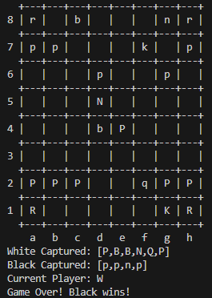

# GM Gene

By Gene Liu(geneliu) and Jeffrey Yang(yjeffrey)

This project implements a basic Chess game and engine in Haskell. The game is played in the terminal using a simple ASCII frontend, and has both a 2 player mode and a human vs computer mode. The computer implements a minimax algorithm with a simple evaluation function to determine its next move.

## Project Structure

The project is structured as follows:

### Source Files

- `src/Chess.hs` implements the core Chess game logic and data structures. This includes all board operations involving move checking, move generation, board updating, and board printing. It also includes testing support with random legal board position generation.

- `src/ChessSimpleAI.hs` includes a simple positional evaluation function for Chess and abstracts the Chess game to a searchable game compatible with the minimax solver.

- `src/GameAI.hs` implements the minimax and negamax algorithms with alpha-beta pruning to search for the best move for the computer to make.

- `src/Parser.hs` is a copy of the parser from lecture.

- `src/ChessParser.hs` implements a simple parser for Chess moves. Note that this is not perform algebraic chess notation parsing and disambiguation, as this was not the focus of the project.

- `src/ChessPlay.hs` implements the main game loops and player interaction components.

### Test Files

- `test/ChessTest.hs` contains unit and quickcheck property tests for the Chess game logic.

- `test/ChessSimpleAITest.hs` tests the simple Chess positional evaluation function with both unit and quickcheck property tests.

- `test/GameAITest.hs` defined property tests for the minimax and negamax algorithms.

- `test/ChessParserTest.hs` contains unit and quickcheck tests for the Chess move parser.

- `test/Spec.hs` simply wraps and runs all tests in the module.

## Usage

Note that this project requires the Haskell [Array](https://hackage.haskell.org/package/array) package in order to compile and run. It is included as a dependency in the `gm-gene.cabal` file.

This project compiles with `stack build`.
You can run the main executable with `stack run`.
You can run the tests with `stack test`.

Finally, you can start a REPL with `stack ghci`.
